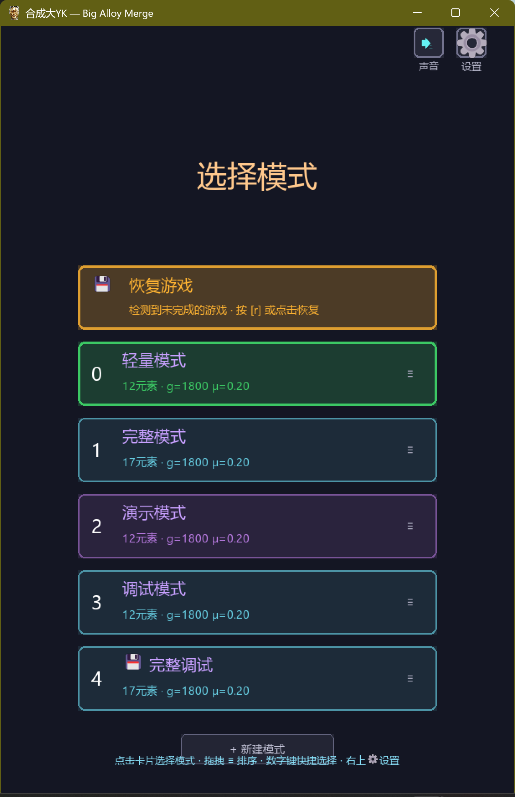
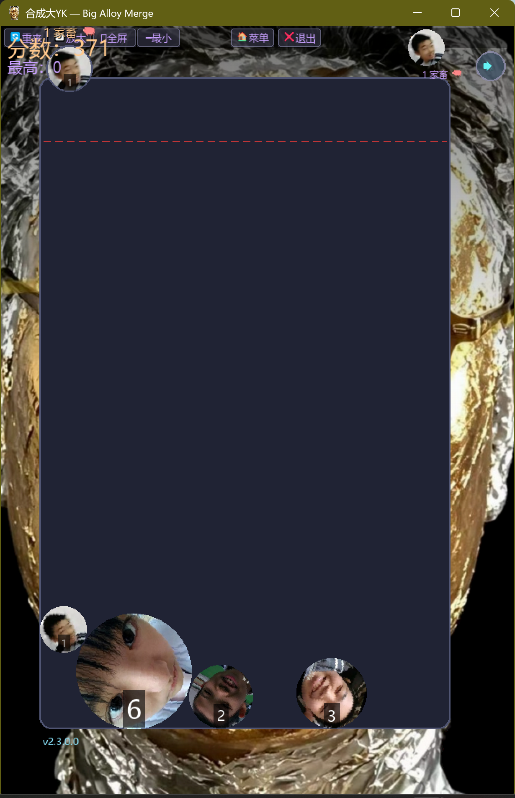
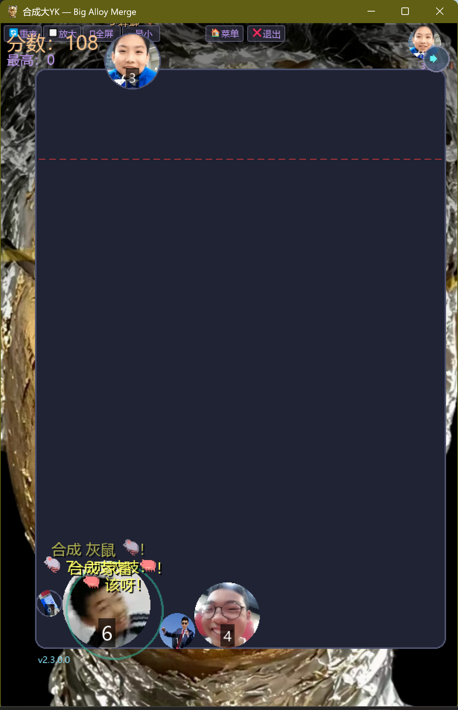
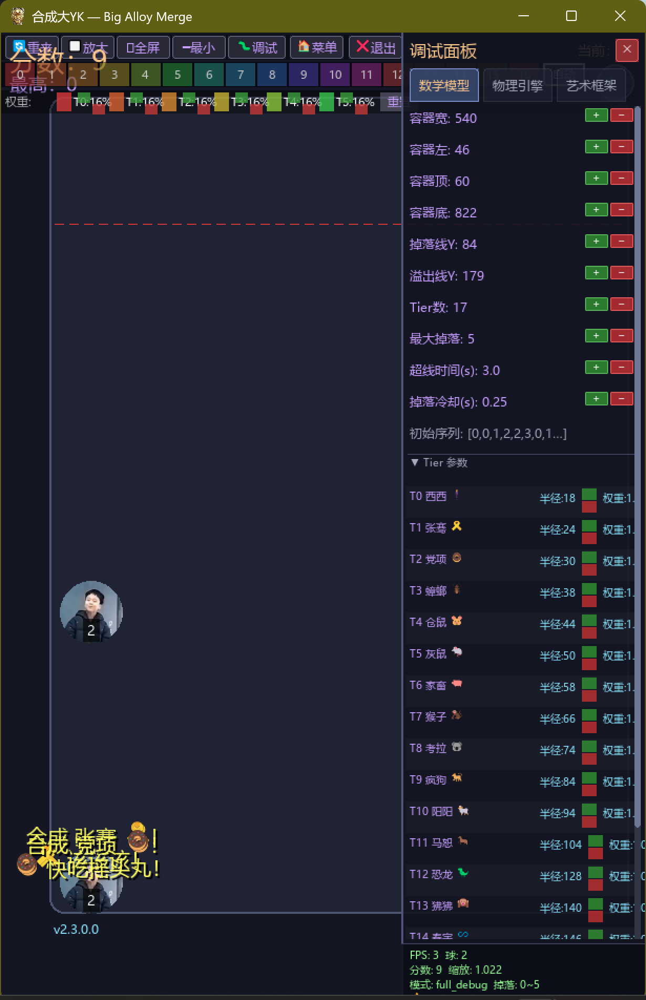
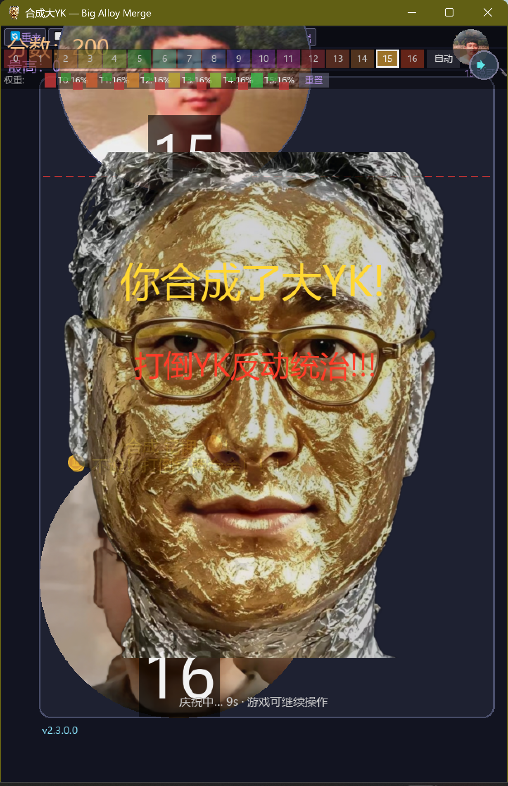

<div align="center">

<a name="top"></a>

# 合成大YK · Big Alloy Merge

**Suika 风格的物理合成小游戏 / A Suika-style physics merge game**

[]()
[]()
[]()
[]()
[]()
[](https://github.com/wanchengyang2010/big-alloy-merge)

> 🌊 **长风破浪版** v2.3.0.0 — 元素重组 + 动态掉落 + 480 FPS + NSIS 安装器
> *"Sometimes you ride the wind; sometimes you face it."*

由 **Trash Panda Q Opal** 出品 · 2026

[🎮 下载发布版](#-快速开始) · [📖 用户手册](USER_GUIDE.md) · [🧪 物理文档](PHYSICS.md) · [📋 更新日志](CHANGELOG.md) · [🐛 反馈 Issue](https://github.com/wanchengyang2010/big-alloy-merge/issues)

</div>

---

## 📑 目录

- [✨ 项目亮点](#-项目亮点)
- [🎬 截图](#-截图)
- [🎯 玩法说明](#-玩法说明)
- [🎮 游戏模式](#-游戏模式)
- [🧪 元素表](#-元素表)
- [⚙️ 操作与快捷键](#-操作与快捷键)
- [🚀 快速开始](#-快速开始)
- [📦 构建与发布](#-构建与发布)
- [🛠️ 架构概览](#-架构概览)
- [🔧 物理引擎](#-物理引擎)
- [🗂️ 项目结构](#-项目结构)
- [🌐 国际化](#-国际化)
- [❓ 常见问题](#-常见问题)
- [🤝 贡献指南](#-贡献指南)
- [⚖️ 版权与肖像权声明](#-版权与肖像权声明)
- [🙏 鸣谢](#-鸣谢)
- [📋 版本历史](#-版本历史)

---

## ✨ 项目亮点

- 🎯 **Suika 经典玩法** — 同等级球碰撞合成升级,堆叠超过溢出线即结束
- 🧬 **17 元素全链** — 从「西西 🕴️」一路合成到「钇钾 🪙」,带独立贴图与音效
- 🖐️ **触屏原生支持** — 容器内按住拖动松手掉落,鼠标/触屏两种交互统一
- ⚡ **480 FPS + vsync** — 帧率翻倍,零撕裂,球体运动顺滑如丝(v2.3 新增)
- 🌀 **旋转物理引擎** — JaneFlyThought2:碰撞扭矩 + 角速度衰减 + 壁面旋转摩擦
- ⚙️ **动态掉落系统** — full 模式合成 N 级解锁掉落 N-2,游戏节奏更紧凑(v2.3 新增)
- 🎨 **三大理论框架** — LambertLiuTheory(数学)+ JaneFlyThought(物理)+ BurningIsm(艺术)
- 💿 **Windows NSIS 安装器** — 桌面/开始菜单快捷方式 + 自带资源 + 源码(v2.3 新增)
- 🔑 **AppData 用户数据** — 存档/高分/配置写入 `%APPDATA%`,无需管理员权限
- 🛠️ **完整调试模式** — 游戏内实时参数面板,所有物理量/视觉参数立即生效
- 🌐 **国际化框架** — 界面全中文,文档中英双语,资源 emoji 友好
- 🎵 **背景音乐 + 合成音效** — 每级球独立音效,合成终极球播放 L'Internationale

---

## 🎬 截图

<p align="center">
  
  
</p>

<p align="center">
  
  
  
</p>

<p align="center">
  
</p>

> 📸 所有截图存放于 [`docs/screenshots/`](docs/screenshots/),由开发者真实运行 v2.3.0.0 截图。

---

## 🎯 玩法说明

**核心规则:**

1. 容器上方出现预览球,鼠标/手指拖动到容器内松手即掉落
2. 两个**同等级**球碰撞 → 自动合成下一级球,获得对应分数
3. 合成后的新球可能继续触发**链式合成**(连锁反应)
4. 球堆超过**红色虚线溢出线**并静止稳定 → Game Over
5. 合成最高级球「钇钾 🪙」→ 全屏庆祝特效 + 胜利音乐

**胜负判定:**

| 状态 | 条件 |
|------|------|
| ✅ 胜利 | 合成出钇钾(tier 16) |
| 💀 失败 | 任意球顶超过溢出线并稳定 ≥ 3 秒 |
| 🎯 调试 | debug_tainted = True 时分数不计入历史 |

**计分:**

每合成一球 → +对应 tier 分数。历史得分写入 `highscore.txt`,最多 20 条,首行为最高分。

---

## 🎮 游戏模式

启动后进入模式选择界面,可点击卡片或按快捷键:

| 模式 | ID | 快捷键 | 元素数 | 调试密码 | 说明 |
|------|-----|--------|--------|----------|------|
| **轻量模式** | `lite` | `B` | 12 | — | **默认** / daxigua 物理复刻 / 推荐新手 |
| **完整模式** | `full` | `A` | 17 | — | **v2.0.4.0 解锁** / 全链合成 / 动态掉落 |
| **调试模式** | `debug` | `C` | 12 | `3919` | 简易调试栏(等级+权重) |
| **完整调试** | `full_debug` | 卡片 | 17 | `3919` | 实时参数面板 / 所有物理量可调 |
| **演示模式** | `demo` | `D` | 12 | — | AI 自动游玩(SmartBot / DumbBot / DemoBot) |
| **Q 自我** | `qself` | `Q` | 12 | — | 自定义图片/名称/合成消息(从 `q_custom.json` 加载) |

**模式对比:**

| 特性 | 轻量 | 完整 | 调试 | 完整调试 | 演示 |
|------|:----:|:----:|:----:|:--------:|:----:|
| 元素数量 | 12 | 17 | 12 | 17 | 12 |
| 容器宽度(参考) | 480 | 540 | 480 | 540 | 480 |
| 溢出线高度 | 135 | 179 | 135 | 179 | 135 |
| 动态掉落 | ❌ | ✅ | ❌ | ✅ | ❌ |
| 实时参数面板 | ❌ | ❌ | 简易 | ✅ | ❌ |
| 分数记录 | ✅ | ✅ | ❌ | ❌ | ❌ |
| AI 控制 | ❌ | ❌ | ❌ | ❌ | ✅ |

---

## 🧪 元素表

### 17 元素全链(完整模式 / 完整调试)

| Tier | 名称 | Emoji | 半径(基) | 分数 | 掉落? | 合成提示 |
|:----:|------|:-----:|:--------:|:----:|:-----:|----------|
| 0 | **西西** ✨ | 🕴️ | 18 | 1 | ✅ | xiiiiii |
| 1 | 张骞 | 🎗️ | 24 | 3 | ✅ | 该该该! |
| 2 | 党项 | 🍩 | 30 | 6 | ✅ | 快吃摇头丸! |
| 3 | 蟑螂 | 🪳 | 38 | 10 | ✅ | 小bug! |
| 4 | 仓鼠 | 🐹 | 44 | 15 | ✅ | 欸啊~~~ |
| 5 | 灰鼠 | 🐁 | 50 | 21 | ✅ | 7+2吱吱吱! |
| 6 | 家畜 | 🐖 | 58 | 28 | 🔄 | 该呀! |
| 7 | 猴子 | 🐒 | 66 | 36 | 🔄 | 127,哎——! |
| 8 | 考拉 | 🐨 | 74 | 45 | 🔄 | 受着! |
| 9 | 疯狗 | 🐕 | 84 | 55 | 🔄 | mi~ke! |
| 10 | 阳阳 | 🐏 | 94 | 66 | 🔄 | 口水攻击! |
| 11 | 马恕 | 🐎 | 104 | 78 | 🔄 | 605! |
| 12 | **恐龙** | 🦖 | 128 | 105 | 🔄 | 打倒军阀! |
| 13 | **狒狒** | 🙉 | 140 | 120 | 🔄 | 你会做人吗? |
| 14 | **春宇** ✨ | ♾️ | 146 | 128 | 🔄 | 闭嘴吧啊 |
| 15 | 锐哥 | 🔪 | 152 | 136 | 🔄 | 你们就是抓不住重点! |
| 16 | **钇钾** 🏆 | 🪙 | 166 | 200 | ⭐ 终极 | 不说!打倒钇钾合金!!! |

> 📌 **v2.3.0.0 变更:** 西西 🕴️ 替换嘟嘟 ☢️(tier 0)· 春宇 ♾️ 插入 tier 14 · 删除雪豹 · 恐龙→12 · 狒狒→13
>
> ✅ = 直接掉落生成 · 🔄 = 合成得到 · ⭐ = 终极合成目标
> ✨ = v2.3.0.0 新增/重命名元素

### 12 元素(轻量模式 / 调试 / 演示)

轻量模式使用独立 12 元素表(物理参数对齐完整模式,半径/分数不同):

| Tier | 名称 | Emoji | 半径(基) | 分数 |
|:----:|------|:-----:|:--------:|:----:|
| 0 | 灰鼠 | 🐁 | 18 | 21 |
| 1 | 家畜 | 🐖 | 28 | 36 |
| 2 | 猴子 | 🐒 | 38 | 45 |
| 3 | 考拉 | 🐨 | 42 | 55 |
| 4 | 疯狗 | 🐕 | 54 | 66 |
| 5 | 阳阳 | 🐏 | 64 | 78 |
| 6 | 马恕 | 🐎 | 68 | 91 |
| 7 | 恐龙 | 🦖 | 108 | 120 |
| 8 | 狒狒 | 🙉 | 108 | 136 |
| 9 | 春宇 | ♾️ | 126 | 168 |
| 10 | 锐哥 | 🔪 | 144 | 200 |
| 11 | 钇钾 🏆 | 🪙 | 168 | 280 |

---

## ⚙️ 操作与快捷键

### 🖱️ 鼠标 / 触屏

| 操作 | 方法 |
|------|------|
| 移动预览 | 鼠标悬停 → 预览球跟随 |
| 掉落球 | 容器内按住拖动 → 松手掉落 |
| 调整位置 | 拖动过程中左右移动 |
| 点击按钮 | 点击顶部按钮栏 |

### ⌨️ 键盘快捷键

| 按键 | 功能 |
|------|------|
| `B` | 进入轻量模式 |
| `A` | 进入完整模式(v2.0.4.0 起) |
| `C` | 进入调试模式(密码 `3919`) |
| `D` | 进入演示模式(AI 自动) |
| `Q` | 进入 Q 自我自定义模式 |
| `R` | 重新开始当前游戏 |
| `F11` | 切换全屏 / 窗口 |
| `F3` | 切换调试面板(仅调试模式) |
| `ESC` | 退出游戏 |

### 🎛️ 按钮栏

顶部按钮栏(从左到右):

| 按钮 | 功能 |
|------|------|
| 🔄 重来 | 重新开始游戏 |
| 🔲 放大 | 窗口最大化(不覆盖任务栏) |
| ⬜ 全屏 | 真全屏 / 窗口切换 |
| ━ 最小 | 最小化窗口 |
| 🐛 调试 | 切换调试面板(仅 debug_allowed) |
| 🏠 菜单 | 返回模式选择主界面 |
| 🔊/🔇 | 静音切换 |
| ❌ 退出 | 退出游戏 |

---

## 🚀 快速开始

### 🪟 Windows 用户(推荐)

**方式一:NSIS 安装器(推荐)**

1. 下载最新 `Big_Alloy_Merge_Setup.exe`
2. 双击运行 → 选择安装目录 → 完成
3. 桌面快捷方式双击启动

**方式二:绿色免安装版**

1. 下载 `Big_Alloy_Merge.exe`(独立可执行,约 157 MB)
2. 双击即可运行,无需安装

### 💻 开发者 / Python 环境

```bash
# 1. 克隆仓库
git clone https://github.com/wanchengyang2010/big-alloy-merge.git
cd big-alloy-merge

# 2. 安装依赖
pip install pygame-ce

# 3. 运行
python main.py
```

**要求:**

- Python 3.14+
- pygame-ce 2.5.7+
- Windows 10/11(触屏可用)
- 约 200 MB 可用磁盘空间(含资源)

---

## 📦 构建与发布

### PyInstaller 单文件打包

```bash
pip install pyinstaller
python -m PyInstaller --onefile --windowed --name "Big_Alloy_Merge" \
  --add-data "assets/yk.png;assets" \
  --add-data "assets/theme.png;assets" \
  --add-data "assets/ring.png;assets" \
  --add-data "assets/settings.png;assets" \
  --add-data "assets/victory.mp3;assets" \
  --add-data "assets/images;assets/images" \
  --add-data "music;music" \
  --add-data "theme.ico;." \
  --add-data "icon.png;." \
  --add-data "elements.txt;." \
  --add-data "Messages.txt;." \
  --version-file "version_info.txt" \
  --icon=theme.ico \
  main.py
```

输出 `dist/Big_Alloy_Merge.exe`(约 157 MB),可独立拷贝到任何 Win10/11 触屏电脑运行。

### NSIS 安装包构建

```bash
# 1. 安装 NSIS 3.x
# 2. 调用构建脚本
python build_installer.py
# 3. 编译 NSIS 脚本
makensis installer.nsi
```

输出 `Big_Alloy_Merge_Setup.exe`,包含:

- ✅ 桌面快捷方式 + 开始菜单程序组
- ✅ 完整资源(图片/音效/背景音乐)
- ✅ Python 源码(便于审计)
- ✅ 可选:安装时输入调试密码 `3919` 预授权开发者工具
- ✅ 干净卸载,可选择保留用户数据

### 发布产物

| 文件 | 说明 |
|------|------|
| `Big_Alloy_Merge.exe` | 绿色免安装版(单文件) |
| `Big_Alloy_Merge_Setup.exe` | NSIS 安装包(含资源+源码) |
| `Big_Alloy_Merge_Source.zip` | 纯 Python 源码 |

### 版本号规则

格式 `v<major>.<minor>.<patch>.<build>`,详见 `version.py`:

| 位 | 含义 | 示例 |
|:--:|------|------|
| `major` | 大功能完成 | v2.0 — 模式系统 |
| `minor` | 功能新增 | v2.3 — 元素重组 + 动态掉落 |
| `patch` | 问题修复 | v2.2.2.5 — 死循环修复 |
| `build` | 小调整 | 参数微调 |

---

## 🛠️ 架构概览

### 三大理论框架

```
┌──────────────────────────────────────────────────────┐
│                   Big Alloy Merge                    │
├──────────────────────────────────────────────────────┤
│  LambertLiuTheory(数学)  JaneFlyThought(物理)  BurningIsm(艺术) │
│  ├ 容器宽高/溢出线       ├ 碰撞冲量/扭矩       ├ 背景图+渐变遮罩  │
│  ├ 每球半径/权重         ├ 重力+旋转+摩擦     ├ 16 种合成音效     │
│  ├ Tier 数/初始序列      ├ 空间哈希网格       ├ 1024×1024 PNG    │
│  └ 等比例缩放            └ 睡眠机制           └ 胜利音乐 L'Internationale │
└──────────────────────────────────────────────────────┘
```

### 核心模块

| 模块 | 职责 |
|------|------|
| `main.py` | 入口、主循环、闪屏、模式选择、拖动交互 |
| `game.py` | 状态管理、合成、计分、超线检测、动态掉落 |
| `physics.py` | 碰撞/重力/磁力/壁摩擦/旋转扭矩、空间网格、即时合成检测 |
| `renderer.py` | 渲染:容器、球、UI、特效、调试面板 |
| `modes.py` | ModeDefinition + ModeManager + 默认模式 + 迁移 |
| `data.py` | TIERS_FULL(17) + TIERS_LITE(12) |
| `constants.py` | 缩放系统 `s()`、物理参数、按钮定义 |
| `item.py` | Item 数据类(位置/速度/角度/角速度/等级/状态) |
| `debug_panel.py` | 游戏内实时参数调试面板(完整调试模式) |
| `settings_ui.py` | 设置界面(声音/语言/模式管理/Q 自我) |
| `image_processor.py` | 任意图片 → 1024×1024 RGBA PNG 自动处理 |
| `updater.py` | 异步 HTTP 检查 GitHub Releases 更新 |
| `autoplay.py` | SmartBot / DumbBot / DemoBot + headless 批量模拟 |
| `tune_sweep.py` | 参数扫描调优 |

### 缩放系统

- 参考分辨率 `600×900`,所有尺寸为基值
- 窗口 resize → `set_scale(min(w/600, h/900))`
- `s(v) = v × scale`:位置、尺寸、半径、物理值均缩放
- Item 半径缓存缩放系数,`Item.radius` 直接返回

### 模块级常量覆写

`game.py` / `physics.py` / `renderer.py` 统一用 `import constants` + `constants.GRAVITY` 访问,**不使用** `from constants import` 拷贝值。lite 模式启动时 `_apply_mode_physics()` 改写 `constants.GRAVITY` 等,所有模块即时感知。

### 物理循环(每帧 `game.update(dt)`)

```
1. dt = min(dt, 0.05)              # 帧时间上限
2. cooldown tick                     # 合成/掉落冷却
3. spawn_protect tick                # 新球保护期
4. game over check                   # 超线检测(重力之前,位置变化量 < 3px/帧)
5. gravity + integration             # 重力 + 位置积分(真空)
6. spatial grid build                # 空间哈希网格
7. magnetic attraction               # 同等级磁吸(full 模式)
8. wall clamp                        # 墙壁约束
9. collision resolution ×4           # 碰撞分离 + 即时合成
10. merge check                      # circles_near() 合成检测
11. sleep mechanism                  # 静止 0.3s → 深度休眠
12. cleanup dead items               # 移除已合成球
```

---

## 🔧 物理引擎

详细参数见 [PHYSICS.md](PHYSICS.md)。以下是快速参考:

### 通用参数

| 参数 | 值 | 说明 |
|------|-----|------|
| `FPS` | **480** (v2.3) | 帧率上限 |
| `COLLISION_PASSES` | 4 | 每帧碰撞迭代 |
| `MERGE_COOLDOWN` | 0.25s | 合成冷却 |
| `MERGE_TOLERANCE` | 3.0 px | 即时合成容错间距 |
| `SLEEP_VELOCITY` | 2.0 px/帧 | 低速休眠阈值 |
| `SLEEP_SETTLE_TIME` | 0.3s | 深度休眠时间 |
| 环境 | 真空 | 无空气阻力 |

### JaneFlyThought2(JFT2 · 当前默认)

| 参数 | 值 | 对比 JFT1 |
|------|-----|-----------|
| `JFT2_GRAVITY` | 1800 px/s² | 2× |
| `JFT2_DAMPING` | 0.0(刚性) | 0.1 → 0 |
| `JFT2_FRICTION` | 0.95(球间库伦摩擦) | 1.0 → 0.95 |
| `JFT2_DROP_DELAY` | 0.25s | 0.5 → 0.25 |
| `JFT2_INITIAL_VY` | 1600 px/s | 2× |
| 质量 | `mass = r × 10` | 线性,避免小半径过轻 |
| 墙反弹 | 0.0(刚性墙) | 触壁即停 |

### 旋转物理(v2.0.1.0 修正,v2.3 减速)

| 参数 | 值 | 说明 |
|------|-----|------|
| `ANGULAR_DAMPING` | **0.92** (v2.3) | 每秒角速度保留系数 |
| `WALL_ROTATIONAL_FRICTION` | 0.40 | 壁面旋转摩擦 |
| `WALL_TORQUE_COUPLING` | **0.015** (v2.3) | 线速度→扭矩耦合 |
| `collision_torque_mult` | **1.0** (v2.3) | 碰撞扭矩乘数(原 2.0) |

### 动态掉落系统(v2.3 新增,仅 full 模式)

```python
# constants.py
DYNAMIC_DROP_ENABLED = True
DYNAMIC_DROP_UNLOCK_OFFSET = 2         # 合成 N 解锁掉落 N-2
DYNAMIC_DROP_RATE_LIMIT = 5            # N-3 级每 5 球限 1 次
DYNAMIC_DROP_RATE_LIMIT_TIGHT = 8      # N-2 级每 8 球限 1 次
```

| 合成到 | 解锁掉落 | 限频 |
|:------:|---------|------|
| Tier 8 | Tier 6 | 每 5 球 1 次 |
| Tier 10 | Tier 7, 8 | 每 8 球 1 次 |
| Tier N | Tier N-2 | 参数可自定义 |

---

## 🗂️ 项目结构

```
big-alloy-merge/
├── main.py                # 入口、主循环、闪屏、模式选择
├── constants.py           # 缩放系统、物理参数、按钮定义
├── data.py                # TIERS_FULL(17) + TIERS_LITE(12)
├── version.py             # 版本号 v2.3.0.0 长风破浪版
├── item.py                # Item 类:位置/速度/角度/角速度/状态
├── game.py                # Game 类:ModeDefinition 驱动,合成,计分
├── physics.py             # 纯函数:碰撞+旋转扭矩,壁摩擦,空间网格
├── renderer.py            # 渲染:容器,球,UI,特效,调试面板
├── modes.py               # ModeDefinition + ModeManager
├── settings_ui.py         # 设置界面
├── debug_panel.py         # 实时参数调试面板
├── image_processor.py     # 任意图片→1024×1024 RGBA PNG
├── updater.py             # 异步 HTTP 检查 GitHub Releases 更新
├── autoplay.py            # SmartBot / DumbBot / DemoBot
├── tune_sweep.py          # 参数扫描调优
├── build_installer.py     # NSIS 安装包构建脚本
├── installer.nsi          # NSIS 安装器脚本
├── LICENSE.txt            # MIT 许可证
├── README.md              # ← 你正在阅读
├── CHANGELOG.md           # 版本更新日志
├── CLAUDE.md              # 内部开发文档(可选,不强制开源)
├── PHYSICS.md             # 物理引擎参数文档
├── USER_GUIDE.md          # 新用户指南
├── elements.txt           # 17 元素名称(带 emoji)
├── Messages.txt           # 合成自定义消息
├── version_info.txt       # PyInstaller Windows 版本信息
├── theme.ico              # 窗口图标
├── icon.png               # 大尺寸图标
├── assets/
│   ├── yk.png             # 启动闪屏背景
│   ├── theme.png          # 庆祝特效背景
│   ├── ring.png           # 暂停按钮图标
│   ├── settings.png       # 设置按钮图标
│   ├── victory.mp3        # 胜利音乐
│   └── images/            # 球图片 0.png ~ 16.png(1024×1024)
├── music/                 # 合成音效(按 tier)
└── releases/              # 历史版本 exe 发布文件夹
    ├── Big_Alloy_Merge_v_1_0_0_1/
    ├── Big_Alloy_Merge_v_1_0_0_2/
    ├── Big_Alloy_Merge_v_1_0_1_0/
    ├── Big_Alloy_Merge_v_1_0_1_1/
    ├── Big_Alloy_Merge_v_1_1_0_1/
    └── Big_Alloy_Merge_v_2_3_0_0/
```

---

## 🌐 国际化

- **界面语言**:全中文(zh-CN)
- **文档语言**:中英双语(本 README + USER_GUIDE + PHYSICS)
- **元素命名**:中文 + emoji,合成提示带中文梗
- **字体**:微软雅黑(`C:/Windows/Fonts/msyh.ttc`)fallback 黑体
- **emoji**:游戏内正常,GBK 终端打印可能乱码

---

## ❓ 常见问题

<details>
<summary><b>Q: 游戏闪退怎么办?</b></summary>

确保 `Big_Alloy_Merge.exe` 与 `_internal/assets/` 在同目录(NSIS 安装版自动处理)。如问题持续,删除 `%APPDATA%\Trash Panda Q Opal\Big Alloy Merge\` 下的 `savegame.json` 和 `highscore.txt` 后重试。
</details>

<details>
<summary><b>Q: 没有声音?</b></summary>

检查游戏内声音开关是否打开(右上角 🔇 图标),检查系统音量设置。首次启动默认开启声音。
</details>

<details>
<summary><b>Q: 窗口太小/太大?</b></summary>

按 `F11` 切换全屏,或点击 🔲 放大按钮最大化窗口(不覆盖任务栏)。也可手动拖拽窗口边缘。
</details>

<details>
<summary><b>Q: 如何修改球的外观?</b></summary>

替换 `assets/images/` 中的对应编号 PNG 文件。图片要求:**1024×1024 正方形、透明背景、PNG 格式**。也可使用内置的「Q 自我」模式(`image_processor.py` 会自动规范化任意图片)。
</details>

<details>
<summary><b>Q: 如何创建自定义游戏模式?</b></summary>

在模式选择界面点击「⚙ 设置」 → 「+ 新建模式」,输入名称后从现有模式复制创建。所有参数(物理/容器/掉落权重)独立可调。
</details>

<details>
<summary><b>Q: 调试密码是什么?</b></summary>

**`3919`** — 在模式选择界面输入即可进入「调试模式」或「完整调试」模式。
</details>

<details>
<summary><b>Q: 游戏太简单/太难?</b></summary>

在「完整调试」模式(密码 `3919`)下按 `F3` 打开实时参数面板,调整重力、摩擦、容器大小、掉落延迟等所有物理量。
</details>

<details>
<summary><b>Q: 如何备份存档?</b></summary>

复制 `%APPDATA%\Trash Panda Q Opal\Big Alloy Merge\` 下的文件即可,重装后放回原位恢复。
</details>

<details>
<summary><b>Q: 用户数据存哪里?</b></summary>

v2.3.0.0 起写入 `%APPDATA%\Trash Panda Q Opal\Big Alloy Merge\`(无需管理员权限)。旧版的程序目录存档仍兼容。
</details>

---

## 🤝 贡献指南

欢迎贡献!项目以个人开发为主,但欢迎以下类型的 PR:

- 🐛 **Bug 修复** — 附复现步骤和预期行为
- 🌐 **国际化** — 翻译、字体、本地化资源
- 🎨 **新元素** — 贴图 + 音效 + emoji + 名称(需肖像权声明)
- ⚡ **性能优化** — 物理引擎/渲染/资源加载
- 📚 **文档** — 注释、教程、翻译

**开发流程:**

```bash
# 1. Fork & Clone
git clone https://github.com/YOUR_NAME/big-alloy-merge.git
cd big-alloy-merge

# 2. 创建分支
git checkout -b feature/your-feature

# 3. 提交(版本号递增 + CHANGELOG.md 同步)
# 修改 version.py + CHANGELOG.md
git commit -m "feat: your feature description"

# 4. 推送 & PR
git push origin feature/your-feature
# 在 GitHub 创建 Pull Request
```

**代码风格:**

- Python 3.14+,PEP 8,中文 docstring
- 中文 UI 字符串,英文代码标识符
- 模块级常量走 `import constants`(不要 `from constants import`)
- 物理参数改动务必更新 `PHYSICS.md`

---

## ⚖️ 版权与肖像权声明

### 版权

```
MIT License

Copyright (c) 2026 Trash Panda Q Opal

Permission is hereby granted, free of charge, to any person obtaining a copy
of this software and associated documentation files (the "Software"), to deal
in the Software without restriction, including without limitation the rights
to use, copy, modify, merge, publish, distribute, sublicense, and/or sell
copies of the Software, and to permit persons to whom the Software is
furnished to do so, subject to the following conditions:

The above copyright notice and this permission notice shall be included in all
copies or substantial portions of the Software.

THE SOFTWARE IS PROVIDED "AS IS", WITHOUT WARRANTY OF ANY KIND, EXPRESS OR
IMPLIED, INCLUDING BUT NOT LIMITED TO THE WARRANTIES OF MERCHANTABILITY,
FITNESS FOR A PARTICULAR PURPOSE AND NONINFRINGEMENT. IN NO EVENT SHALL THE
AUTHORS OR COPYRIGHT HOLDERS BE LIABLE FOR ANY CLAIM, DAMAGES OR OTHER
LIABILITY, WHETHER IN AN ACTION OF CONTRACT, TORT OR OTHERWISE, ARISING FROM,
OUT OF OR IN CONNECTION WITH THE SOFTWARE OR THE USE OR OTHER DEALINGS IN THE
SOFTWARE.
```

详见 [LICENSE.txt](LICENSE.txt)。

### 肖像权声明

本游戏角色图片可能包含基于真实人物形象创作的内容。

**如有侵犯您的肖像权或其他合法权益,请通过 [GitHub Issues](https://github.com/wanchengyang2010/big-alloy-merge/issues) 联系我们,我们将在核实后第一时间删除相关内容。**

---

## 🙏 鸣谢

### 物理引擎致敬

- **[yieio/daxigua](https://github.com/yieio/daxigua)** — 容器比例、球半径、重力参数的精确复刻来源。感谢原作者的开源贡献。
- **[suika-game](https://suikagame.com/)** — Suika 玩法原始灵感

### 技术栈

- **[pygame-ce](https://pygame-ce.org/)** — Community Edition,Python 游戏开发框架
- **[Python](https://www.python.org/)** — 编程语言
- **[PyInstaller](https://pyinstaller.org/)** — 单文件打包
- **[NSIS](https://nsis.sourceforge.io/)** — Windows 安装器制作

### 资源

- 音效素材来自开源音效库
- 字体使用系统自带微软雅黑
- emoji 采用 Unicode 标准

### 特别鸣谢 · F15 班小组

这款游戏是班集体共同的成果,感谢以下同学在背后的付出:

| 同学 | 贡献 |
|:----:|------|
| 🖼️ **YWL** | 图片提供 |
| 🧠 **GJS · SJY** | 游戏逻辑策划 |
| 💡 **DSR** | 改进建议 |
| 🎮 **LYM** | 孜孜不倦地试玩 |
| 🛠️ **LBC** | 提供了好用的工具 |

以及所有在 [Issues](https://github.com/wanchengyang2010/big-alloy-merge/issues) 反馈 Bug、提出建议的玩家们。

---

## 📋 版本历史

> 完整更新日志见 [CHANGELOG.md](CHANGELOG.md)

### 🌊 v2.3.0.0 (2026-06-22) — 长风破浪版 · **当前版本**

**元素重组 + 动态掉落 + 物理优化 + UI 增强 + 安装器**

- 🕴️ **西西替换嘟嘟**(tier 0):新图片 + 合成提示 "xiiiiii"
- ♾️ **春宇插入锐哥前**(tier 14):新图片 + 合成提示 "闭嘴吧啊"
- 🗑️ **删除雪豹**:恐龙→12、狒狒→13
- ⚡ **动态掉落系统**(full 模式):合成 N 级解锁掉落 N-2,限频可自定义
- 🚀 **帧率翻倍**:FPS 120→**480**,所有窗口 **vsync** 防撕裂
- 🔄 **旋转减速**:ANGULAR_DAMPING 0.98→**0.92**,碰撞扭矩 2.0→**1.0**,壁耦合 0.03→**0.015**
- 📝 **掉落信息显示**:预览球上方显示 "{tier} {name}" + 合成提示
- 💿 **NSIS 安装器**:含全部资源 + Python 源码,可选调试密码预授权
- 🔑 **用户数据迁移 `%APPDATA%`**:存档/配置/最高分无需管理员权限
- 🖼️ **图标+闪屏更新**:`newicon.ico` + `newflash.jfif`
- 🐛 修复 `_dynamic_drop` 初始化顺序崩溃

### ⚡ v2.2.2.5 (2026-06-18) — 星芒璀璨版

- 🐛 修复 `_check_merges` 死循环(游戏启动即卡死)
- ⚡ 即时合成全面生效(`circles_near()` 容错 3px)
- 🔄 GitHub 更新通知线程安全
- ⌨️ 补全 `a` 键快捷进入完整模式
- 📐 `COLLISION_PASSES` 10→4

### 🔧 v2.2.2.3 (2026-06-16)

- 🔧 物理引擎修复(壁摩擦重写,不再粘壁)
- 🪟 正规 Windows NSIS 安装程序(MUI2 现代向导)

### 🏠 v2.1.0.0 (2026-06-13)

- 🏠 返回主界面按钮
- 💾 分模式独立存档
- 🎛️ 轻量调试模式支持实时面板

### 🔓 v2.0.4.0 (2026-06-13)

- 🔓 完整模式(17 元素)解锁
- 🛠️ 完整调试模式 + 实时参数调试面板

### 🌀 v2.0.1.0 (2026-06-12)

- 🌀 旋转物理引擎大修(dt 无关角速度衰减)
- 🎨 新图标 + 新背景

### 🏗️ v2.0.0.0 (2026-06-12)

- 🏗️ 全方位模式自定义化
- 三大理论框架:LambertLiuTheory + JaneFlyThought + BurningIsm

<details>
<summary><b>📜 点击展开更早版本</b></summary>

### v1.1.0.2 (2026-06)

- 🐛 穿模重叠 + 抖动修复
- 睡眠机制 + 质量平衡(r² → r×10)

### v1.1.0.1 (2026-06)

- 🚀 JaneFlyThought2 物理引擎(重力 1800/初速 1600)
- 🎨 Q 自我模式 + 自动恢复存档
- 🎉 合成终极球庆祝特效

### v1.0.1.1 (2026-06)

- 自适应初始窗口尺寸
- GitHub Release 发布

### v1.0.0.0 (2026-06)

- 启动闪屏 + exe 元数据
- 正式发布

### v0.5.0.0 (2026-06)

- 模式选择界面
- 11 元素模式 + 合成消息 + 独立 exe

### v0.4.0.0

- 基础功能完成

</details>

---

<div align="center">

## 🕯️ 谨以此,献给

### 西北工业大学附属中学
### 初 2026 届 · F15 班

**2026 年 6 月 22 日,YK 反动统治覆灭**

</div>

---

<div align="center">

**🌊 长风破浪,会有时 — Big Alloy Merge v2.3.0.0 🌊**

[](https://github.com/wanchengyang2010/big-alloy-merge/stargazers)
[](https://github.com/wanchengyang2010/big-alloy-merge/network/members)

由 **Trash Panda Q Opal** 用 ❤️ 制作

[⬆ 回到顶部](#top)

</div>